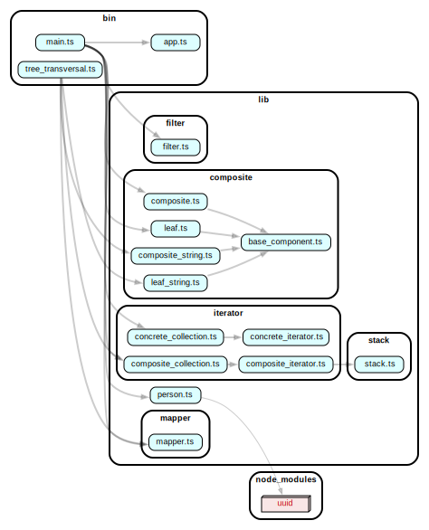

# mapper

Ejercicio tipo quiz

## Para correr el proyecto

- Tener [node](https://nodejs.org/en/)
- Clonar repo
- Ejecutar `npm install` para instalar dependecias (ts-node, typescript, etc...)
- Ejeutar `npm start` para correr el proyecto

**Output:**

```bash
Result: Ines[60] -> Children: (Arturo[23], Andrea[25] -> Children: (Pedrito[4], Valeria[2]))
[ 120, 50, 4, 8, 46 ]
[ '23 edad', '22 edad', '23 edad', '22 edad' ]
```

## Grafo de dependencias del proyecto


